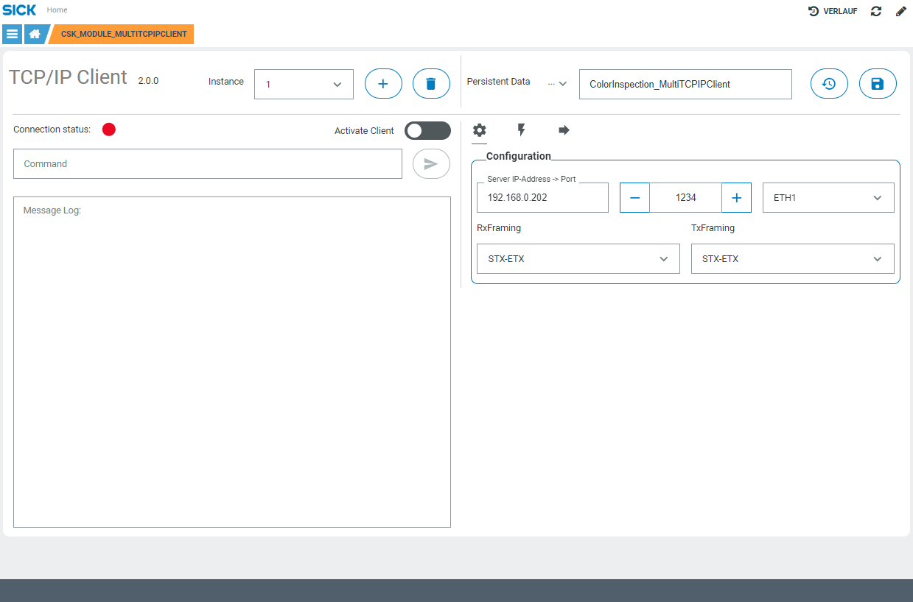

# CSK_Module_MultiTCPIPClient

Module to provide TCP/IP client functionality on multiple instances.

## How to Run
The app includes an intuitive GUI to setup the communication.  
For further information check out the [documentation](https://raw.githack.com/SICKAppSpaceCodingStarterKit/CSK_Module_MultiTCPIPClient/main/docu/CSK_Module_MultiTCPIPClient.html) in the folder "docu".

## Known issues

In case of using the SICK AppEngine please keep in mind for selecting the ethernet interface, neither all selectable interfaces are available nor coincide with the name of the operating system.

## Information

Tested on  

|Device|Firmware|Module version|
|--|--|--|
|SIM1012|v2.4.2|v2.0.0|
|SIM1012|v2.4.1|v1.0.0|
|SIM1012|v2.3.0|v1.0.0|
|SIM2000|v1.6.0|v1.0.0|
|SICK AppEngine|v1.7.0|v2.0.0|
|SICK AppEngine|v1.5.0|v1.0.0|
|InspectorP631|v4.2.1|v1.0.0|
|InspectorP631|v4.0.0|v1.0.0|

This module is part of the SICK AppSpace Coding Starter Kit developing approach.  
It is programmed in an object-oriented way. Some of the modules use kind of "classes" in Lua to make it possible to reuse code / classes in other projects.  
In general, it is not neccessary to code this way, but the architecture of this app can serve as a sample to be used especially for bigger projects and to make it easier to share code.  
Please check the [documentation](https://github.com/SICKAppSpaceCodingStarterKit/.github/blob/main/docu/SICKAppSpaceCodingStarterKit_Documentation.md) of CSK for further information.  

## Topics

Coding Starter Kit, CSK, Module, SICK-AppSpace, TCP, IP, TCPIP, Client
